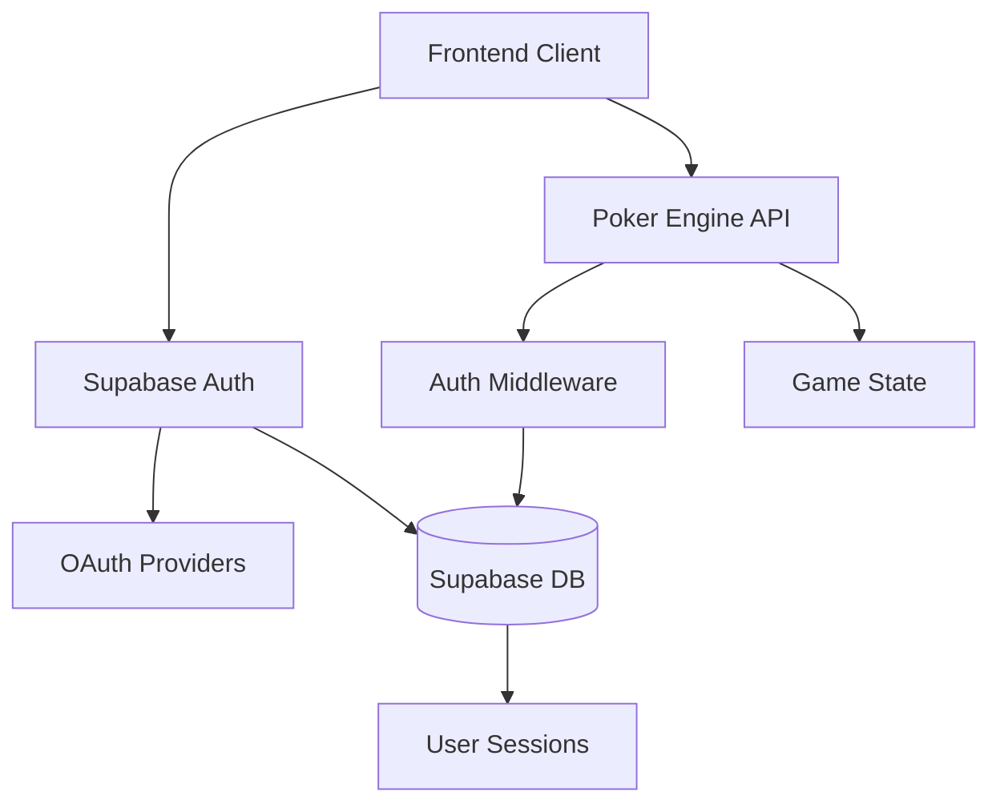

# 🔐 AUTHENTICATION ARCHITECTURE DEEP DIVE

**Goal**: Production-ready auth system with multiple providers, session management, and seamless user experience

---

## 🏗️ **ARCHITECTURE OVERVIEW**



---

## 🔑 **SUPABASE AUTH CONFIGURATION**

### **Project Setup**
```typescript
// supabase/config.ts
export const supabaseConfig = {
  url: process.env.NEXT_PUBLIC_SUPABASE_URL!,
  anonKey: process.env.NEXT_PUBLIC_SUPABASE_ANON_KEY!,
  providers: [
    'email',
    'google',
    'discord',
    'github',
    'anonymous'
  ]
}
```

### **Auth Providers Configuration**
```typescript
// Providers setup in Supabase Dashboard
const providers = {
  email: {
    enabled: true,
    confirmEmail: true,
    minPasswordLength: 8,
    passwordRequirements: {
      minLength: 8,
      requireUppercase: true,
      requireLowercase: true,
      requireNumbers: true,
      requireSymbols: false
    }
  },
  google: {
    enabled: true,
    clientId: process.env.GOOGLE_CLIENT_ID,
    clientSecret: process.env.GOOGLE_CLIENT_SECRET,
    redirectUrl: `${process.env.NEXT_PUBLIC_SITE_URL}/auth/callback`
  },
  discord: {
    enabled: true,
    clientId: process.env.DISCORD_CLIENT_ID,
    clientSecret: process.env.DISCORD_CLIENT_SECRET,
    redirectUrl: `${process.env.NEXT_PUBLIC_SITE_URL}/auth/callback`
  },
  github: {
    enabled: true,
    clientId: process.env.GITHUB_CLIENT_ID,
    clientSecret: process.env.GITHUB_CLIENT_SECRET,
    redirectUrl: `${process.env.NEXT_PUBLIC_SITE_URL}/auth/callback`
  },
  anonymous: {
    enabled: true,
    maxSessionDuration: '24 hours'
  }
}
```

---

## 📊 **DATABASE SCHEMA**

### **User Profiles Extension**
```sql
-- Extend auth.users with custom profile data
CREATE TABLE public.user_profiles (
  id UUID REFERENCES auth.users(id) PRIMARY KEY,
  username VARCHAR(20) UNIQUE NOT NULL,
  display_name VARCHAR(50),
  avatar_url TEXT,
  bio TEXT,
  location VARCHAR(100),
  website TEXT,
  created_at TIMESTAMPTZ DEFAULT NOW(),
  updated_at TIMESTAMPTZ DEFAULT NOW(),
  
  -- Poker-specific fields
  total_games_played INTEGER DEFAULT 0,
  total_winnings BIGINT DEFAULT 0,
  best_hand TEXT,
  favorite_position VARCHAR(20),
  
  -- Preferences
  auto_rebuy BOOLEAN DEFAULT false,
  auto_show_cards BOOLEAN DEFAULT true,
  sound_enabled BOOLEAN DEFAULT true,
  animations_enabled BOOLEAN DEFAULT true,
  
  -- Privacy
  show_online_status BOOLEAN DEFAULT true,
  allow_friend_requests BOOLEAN DEFAULT true,
  show_game_history BOOLEAN DEFAULT true
);

-- RLS (Row Level Security) policies
ALTER TABLE public.user_profiles ENABLE ROW LEVEL SECURITY;

-- Users can read all profiles
CREATE POLICY "Public profiles are viewable by everyone" ON public.user_profiles
  FOR SELECT USING (true);

-- Users can only update their own profile
CREATE POLICY "Users can update own profile" ON public.user_profiles
  FOR UPDATE USING (auth.uid() = id);

-- Users can only insert their own profile
CREATE POLICY "Users can insert own profile" ON public.user_profiles
  FOR INSERT WITH CHECK (auth.uid() = id);
```

### **User Sessions Tracking**
```sql
-- Track active user sessions
CREATE TABLE public.user_sessions (
  id UUID PRIMARY KEY DEFAULT uuid_generate_v4(),
  user_id UUID REFERENCES auth.users(id),
  session_token TEXT UNIQUE NOT NULL,
  game_id TEXT, -- Current game if in one
  room_id TEXT, -- Current room if in one
  socket_id TEXT, -- WebSocket connection ID
  ip_address INET,
  user_agent TEXT,
  created_at TIMESTAMPTZ DEFAULT NOW(),
  last_activity TIMESTAMPTZ DEFAULT NOW(),
  expires_at TIMESTAMPTZ DEFAULT (NOW() + INTERVAL '24 hours'),
  is_active BOOLEAN DEFAULT true
);

-- Indexes for performance
CREATE INDEX idx_user_sessions_user_id ON public.user_sessions(user_id);
CREATE INDEX idx_user_sessions_token ON public.user_sessions(session_token);
CREATE INDEX idx_user_sessions_active ON public.user_sessions(is_active, expires_at);

-- RLS policies
ALTER TABLE public.user_sessions ENABLE ROW LEVEL SECURITY;

CREATE POLICY "Users can view own sessions" ON public.user_sessions
  FOR SELECT USING (auth.uid() = user_id);
```

---

## 🎯 **FRONTEND AUTH IMPLEMENTATION**

### **Auth Context & Hooks**
```typescript
// contexts/AuthContext.tsx
import { createContext, useContext, useEffect, useState } from 'react'
import { User, Session } from '@supabase/supabase-js'
import { supabase } from '@/lib/supabase'

interface AuthContextType {
  user: User | null
  session: Session | null
  profile: UserProfile | null
  loading: boolean
  signIn: (email: string, password: string) => Promise<void>
  signUp: (email: string, password: string, username: string) => Promise<void>
  signInWithProvider: (provider: 'google' | 'discord' | 'github') => Promise<void>
  signInAnonymously: () => Promise<void>
  signOut: () => Promise<void>
  updateProfile: (updates: Partial<UserProfile>) => Promise<void>
}

export const AuthProvider = ({ children }: { children: React.ReactNode }) => {
  const [user, setUser] = useState<User | null>(null)
  const [session, setSession] = useState<Session | null>(null)
  const [profile, setProfile] = useState<UserProfile | null>(null)
  const [loading, setLoading] = useState(true)

  useEffect(() => {
    // Get initial session
    supabase.auth.getSession().then(({ data: { session } }) => {
      setSession(session)
      setUser(session?.user ?? null)
      if (session?.user) {
        fetchUserProfile(session.user.id)
      }
      setLoading(false)
    })

    // Listen for auth changes
    const { data: { subscription } } = supabase.auth.onAuthStateChange(
      async (event, session) => {
        setSession(session)
        setUser(session?.user ?? null)
        
        if (event === 'SIGNED_IN' && session?.user) {
          await fetchUserProfile(session.user.id)
        } else if (event === 'SIGNED_OUT') {
          setProfile(null)
        }
        
        setLoading(false)
      }
    )

    return () => subscription.unsubscribe()
  }, [])

  const fetchUserProfile = async (userId: string) => {
    try {
      const { data, error } = await supabase
        .from('user_profiles')
        .select('*')
        .eq('id', userId)
        .single()

      if (error && error.code !== 'PGRST116') { // Not found is ok
        console.error('Error fetching profile:', error)
        return
      }

      setProfile(data)
    } catch (error) {
      console.error('Error fetching profile:', error)
    }
  }

  // Auth methods implementation...
}
```

### **Auth Pages Structure**
```typescript
// pages/auth/
├── login.tsx           // Email/password login
├── signup.tsx          // Email/password signup
├── providers.tsx       // OAuth provider buttons
├── callback.tsx        // OAuth callback handler
├── forgot-password.tsx // Password reset
├── profile-setup.tsx   // First-time profile setup
└── anonymous.tsx       // Anonymous login
```

### **Login Component**
```typescript
// components/auth/LoginForm.tsx
import { useState } from 'react'
import { useAuth } from '@/contexts/AuthContext'

export const LoginForm = () => {
  const [email, setEmail] = useState('')
  const [password, setPassword] = useState('')
  const [loading, setLoading] = useState(false)
  const { signIn } = useAuth()

  const handleSubmit = async (e: React.FormEvent) => {
    e.preventDefault()
    setLoading(true)
    
    try {
      await signIn(email, password)
      // Redirect handled by AuthContext
    } catch (error) {
      // Handle error (show toast, etc.)
    } finally {
      setLoading(false)
    }
  }

  return (
    <form onSubmit={handleSubmit} className="space-y-4">
      <input
        type="email"
        placeholder="Email"
        value={email}
        onChange={(e) => setEmail(e.target.value)}
        required
      />
      <input
        type="password"
        placeholder="Password"
        value={password}
        onChange={(e) => setPassword(e.target.value)}
        required
      />
      <button type="submit" disabled={loading}>
        {loading ? 'Signing in...' : 'Sign In'}
      </button>
    </form>
  )
}
```

### **OAuth Provider Buttons**
```typescript
// components/auth/ProviderButtons.tsx
export const ProviderButtons = () => {
  const { signInWithProvider } = useAuth()

  return (
    <div className="space-y-3">
      <button
        onClick={() => signInWithProvider('google')}
        className="w-full flex items-center justify-center gap-3 bg-white text-gray-900 border border-gray-300 rounded-lg px-4 py-3 hover:bg-gray-50"
      >
        <GoogleIcon />
        Continue with Google
      </button>
      
      <button
        onClick={() => signInWithProvider('discord')}
        className="w-full flex items-center justify-center gap-3 bg-[#5865F2] text-white rounded-lg px-4 py-3 hover:bg-[#4752C4]"
      >
        <DiscordIcon />
        Continue with Discord
      </button>
      
      <button
        onClick={() => signInWithProvider('github')}
        className="w-full flex items-center justify-center gap-3 bg-gray-900 text-white rounded-lg px-4 py-3 hover:bg-gray-800"
      >
        <GitHubIcon />
        Continue with GitHub
      </button>
    </div>
  )
}
```

---

## 🔧 **BACKEND AUTH INTEGRATION**

### **Auth Middleware**
```typescript
// middleware/auth.ts
import { createMiddlewareClient } from '@supabase/auth-helpers-nextjs'
import { NextResponse } from 'next/server'
import type { NextRequest } from 'next/server'

export async function middleware(req: NextRequest) {
  const res = NextResponse.next()
  const supabase = createMiddlewareClient({ req, res })

  const {
    data: { session },
  } = await supabase.auth.getSession()

  // Protected routes
  if (req.nextUrl.pathname.startsWith('/game') && !session) {
    return NextResponse.redirect(new URL('/auth/login', req.url))
  }

  // Auth routes redirect if already logged in
  if (req.nextUrl.pathname.startsWith('/auth') && session) {
    return NextResponse.redirect(new URL('/lobby', req.url))
  }

  return res
}

export const config = {
  matcher: [
    '/((?!api|_next/static|_next/image|favicon.ico).*)',
  ],
}
```

### **API Route Protection**
```typescript
// lib/auth.ts
import { createRouteHandlerClient } from '@supabase/auth-helpers-nextjs'
import { cookies } from 'next/headers'
import { NextRequest } from 'next/server'

export async function getAuthenticatedUser(req: NextRequest) {
  const supabase = createRouteHandlerClient({ cookies })
  
  const {
    data: { session },
    error
  } = await supabase.auth.getSession()

  if (error || !session) {
    return { user: null, session: null, error }
  }

  // Fetch user profile
  const { data: profile } = await supabase
    .from('user_profiles')
    .select('*')
    .eq('id', session.user.id)
    .single()

  return { user: session.user, session, profile, error: null }
}

// Usage in API routes
export async function GET(req: NextRequest) {
  const { user, profile, error } = await getAuthenticatedUser(req)
  
  if (error || !user) {
    return NextResponse.json({ error: 'Unauthorized' }, { status: 401 })
  }

  // Protected route logic here
  return NextResponse.json({ data: 'protected data' })
}
```

### **WebSocket Auth Integration**
```typescript
// sophisticated-engine-server.js (updated)
const { createClient } = require('@supabase/supabase-js')

// Initialize Supabase client
const supabase = createClient(
  process.env.SUPABASE_URL,
  process.env.SUPABASE_ANON_KEY
)

// Auth middleware for WebSocket connections
io.use(async (socket, next) => {
  try {
    const token = socket.handshake.auth.token
    if (!token) {
      return next(new Error('Authentication token required'))
    }

    // Verify token with Supabase
    const { data: { user }, error } = await supabase.auth.getUser(token)
    
    if (error || !user) {
      return next(new Error('Invalid authentication token'))
    }

    // Fetch user profile
    const { data: profile } = await supabase
      .from('user_profiles')
      .select('*')
      .eq('id', user.id)
      .single()

    socket.userId = user.id
    socket.userProfile = profile
    next()
  } catch (error) {
    next(new Error('Authentication failed'))
  }
})

// Updated connection handler
io.on('connection', async (socket) => {
  const { userId, userProfile } = socket
  
  console.log(`User ${userProfile?.username || userId} connected`)
  
  // Store session
  await storeUserSession(userId, socket.id)
  
  socket.on('disconnect', async () => {
    await cleanupUserSession(userId, socket.id)
  })
})
```

---

## 🔄 **SESSION MANAGEMENT**

### **Session Storage & Recovery**
```typescript
// lib/session.ts
export class SessionManager {
  private static instance: SessionManager
  
  static getInstance() {
    if (!SessionManager.instance) {
      SessionManager.instance = new SessionManager()
    }
    return SessionManager.instance
  }

  async storeSession(userId: string, gameId: string, roomId: string) {
    const { error } = await supabase
      .from('user_sessions')
      .upsert({
        user_id: userId,
        game_id: gameId,
        room_id: roomId,
        last_activity: new Date().toISOString(),
        expires_at: new Date(Date.now() + 24 * 60 * 60 * 1000).toISOString()
      })

    if (error) {
      console.error('Error storing session:', error)
    }
  }

  async recoverSession(userId: string) {
    const { data, error } = await supabase
      .from('user_sessions')
      .select('*')
      .eq('user_id', userId)
      .eq('is_active', true)
      .single()

    if (error || !data) {
      return null
    }

    // Check if session is still valid
    if (new Date(data.expires_at) < new Date()) {
      await this.invalidateSession(userId)
      return null
    }

    return data
  }

  async invalidateSession(userId: string) {
    await supabase
      .from('user_sessions')
      .update({ is_active: false })
      .eq('user_id', userId)
  }
}
```

### **Frontend Session Recovery**
```typescript
// hooks/useSessionRecovery.ts
export const useSessionRecovery = () => {
  const { user } = useAuth()
  const router = useRouter()

  useEffect(() => {
    if (!user) return

    const recoverSession = async () => {
      try {
        // Check if user was in a game
        const { data: session } = await supabase
          .from('user_sessions')
          .select('*')
          .eq('user_id', user.id)
          .eq('is_active', true)
          .single()

        if (session?.game_id) {
          // Show recovery modal
          const shouldRecover = confirm(
            `You were in a game. Would you like to rejoin?`
          )
          
          if (shouldRecover) {
            router.push(`/game/${session.game_id}`)
          }
        }
      } catch (error) {
        console.error('Session recovery error:', error)
      }
    }

    recoverSession()
  }, [user, router])
}
```

---

## 🎨 **USER EXPERIENCE FLOWS**

### **Anonymous User Flow**
```typescript
// Allow anonymous users to play immediately
const AnonymousFlow = () => {
  const { signInAnonymously } = useAuth()

  const handleQuickPlay = async () => {
    await signInAnonymously()
    // Redirect to lobby with limited features
  }

  return (
    <div className="quick-play">
      <h2>Play Poker Now</h2>
      <button onClick={handleQuickPlay}>
        Play as Guest
      </button>
      <p>Sign up later to save your progress</p>
    </div>
  )
}
```

### **Profile Setup Flow**
```typescript
// First-time user profile setup
const ProfileSetup = () => {
  const [username, setUsername] = useState('')
  const [displayName, setDisplayName] = useState('')
  const [avatar, setAvatar] = useState('')

  const handleComplete = async () => {
    await updateProfile({
      username,
      display_name: displayName,
      avatar_url: avatar
    })
    router.push('/lobby')
  }

  return (
    <div className="profile-setup">
      <h2>Complete Your Profile</h2>
      <form onSubmit={handleComplete}>
        <input
          placeholder="Username"
          value={username}
          onChange={(e) => setUsername(e.target.value)}
        />
        <input
          placeholder="Display Name"
          value={displayName}
          onChange={(e) => setDisplayName(e.target.value)}
        />
        <button type="submit">Complete Setup</button>
      </form>
    </div>
  )
}
```

---

## 🔐 **SECURITY CONSIDERATIONS**

### **JWT Token Security**
- Tokens stored in httpOnly cookies
- Short-lived access tokens (1 hour)
- Long-lived refresh tokens (7 days)
- Automatic token refresh

### **Rate Limiting**
```typescript
// Rate limiting for auth endpoints
const rateLimit = new Map()

export const checkRateLimit = (ip: string, endpoint: string) => {
  const key = `${ip}:${endpoint}`
  const now = Date.now()
  const windowMs = 15 * 60 * 1000 // 15 minutes
  const maxAttempts = 5

  const attempts = rateLimit.get(key) || []
  const recentAttempts = attempts.filter((time: number) => now - time < windowMs)

  if (recentAttempts.length >= maxAttempts) {
    throw new Error('Rate limit exceeded')
  }

  recentAttempts.push(now)
  rateLimit.set(key, recentAttempts)
}
```

### **Input Validation**
```typescript
// Username validation
export const validateUsername = (username: string) => {
  const errors = []
  
  if (username.length < 3) {
    errors.push('Username must be at least 3 characters')
  }
  
  if (username.length > 20) {
    errors.push('Username must be less than 20 characters')
  }
  
  if (!/^[a-zA-Z0-9_]+$/.test(username)) {
    errors.push('Username can only contain letters, numbers, and underscores')
  }
  
  return errors
}
```

---

## 📱 **MOBILE CONSIDERATIONS**

### **Responsive Auth UI**
```typescript
// Mobile-optimized auth forms
const AuthForm = () => {
  return (
    <div className="auth-form">
      <div className="mobile-header">
        <h1>Welcome to PokerGeek</h1>
        <p>Sign in to play with friends</p>
      </div>
      
      <form className="mobile-form">
        {/* Touch-optimized inputs */}
      </form>
      
      <div className="social-login">
        {/* Large touch targets */}
      </div>
    </div>
  )
}
```

### **Biometric Authentication**
```typescript
// Support for biometric auth on mobile
const BiometricAuth = () => {
  const [isSupported, setIsSupported] = useState(false)

  useEffect(() => {
    // Check if WebAuthn is supported
    if (window.PublicKeyCredential) {
      setIsSupported(true)
    }
  }, [])

  const handleBiometricAuth = async () => {
    try {
      const credential = await navigator.credentials.get({
        publicKey: {
          challenge: new Uint8Array(32),
          allowCredentials: [],
          timeout: 60000,
        }
      })
      
      // Verify with Supabase
      await supabase.auth.signInWithIdToken({
        provider: 'apple',
        token: credential.id
      })
    } catch (error) {
      console.error('Biometric auth failed:', error)
    }
  }
}
```

---

## 🚀 **IMPLEMENTATION PHASES**

### **Phase 1: Basic Auth** (Day 1-2)
- [ ] Supabase project setup
- [ ] Email/password auth
- [ ] Basic user profiles
- [ ] Auth context & hooks

### **Phase 2: OAuth Providers** (Day 3-4)
- [ ] Google OAuth setup
- [ ] Discord OAuth setup
- [ ] GitHub OAuth setup
- [ ] OAuth callback handling

### **Phase 3: Session Management** (Day 5-6)
- [ ] Session storage & recovery
- [ ] WebSocket auth integration
- [ ] Auto-reconnection logic
- [ ] Session cleanup

### **Phase 4: Advanced Features** (Day 7-8)
- [ ] Anonymous auth
- [ ] Profile setup flow
- [ ] Password reset
- [ ] Email verification

### **Phase 5: Security & Polish** (Day 9-10)
- [ ] Rate limiting
- [ ] Input validation
- [ ] Mobile optimization
- [ ] Error handling

---

## 🎯 **SUCCESS METRICS**

### **Auth Performance**
- Login success rate > 95%
- Time to auth < 2 seconds
- Session recovery rate > 90%
- OAuth conversion rate > 70%

### **User Experience**
- Profile completion rate > 80%
- Anonymous to registered conversion > 30%
- Session persistence success > 95%
- Mobile auth success rate > 90%

**Ready to start implementing? Which phase should we tackle first?**
